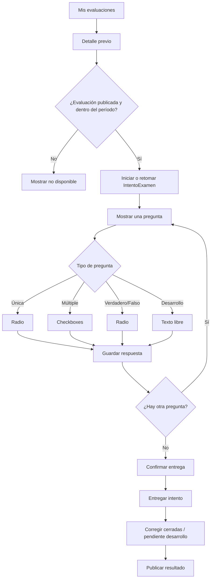

# Evaluaciones de residentes - alcance y estado del MVP

Estado: MVP funcional listo para piloto controlado; mejoras operativas posteriores pendientes

Fecha de definición: 13/09/2026
Última actualización: 21/09/2026

## Estado actual de implementación

### Implementado

- App Django independiente `evaluaciones_residentes/` registrada en settings.
- Modelos de examen, pregunta, opción, intento, respuesta y opciones elegidas.
- Tipos de pregunta: opción única, opción múltiple, verdadero/falso y desarrollo.
- Imágenes opcionales almacenadas en S3 privado bajo `evaluaciones_residentes/`.
- Galería de múltiples imágenes por pregunta, con preview, eliminación pendiente y reordenamiento antes de guardar.
- Publicación transaccional y congelación de preguntas, opciones, imágenes y puntajes.
- Corrección cerrada sin puntaje parcial para opción múltiple.
- Corrección manual de respuestas desarrolladas.
- Editor docente de borradores, preguntas, opciones y revisión previa.
- Navegación docente por pasos: datos generales, preguntas y revisión/publicación.
- Vista de revisión con estructura equivalente a la experiencia del residente.
- Eliminación confirmada de borradores, con limpieza de preguntas e imágenes asociadas.
- Bandeja residente y detalle previo de evaluación publicados.
- Inicio y reanudación segura de `IntentoExamen`.
- Pantalla de intento por pregunta, sin exponer respuestas correctas.
- Guardado de respuestas por pregunta y reanudación visual del intento.
- Recuperación de opciones seleccionadas y texto de desarrollo previamente guardados.
- Bloqueo de respuestas fuera del período de la evaluación.
- Navegación hacia pregunta anterior con guardado al navegar.
- Entrega final del intento desde la última pregunta, con bloqueo posterior de edición.
- Pantalla de confirmación con resumen de preguntas respondidas y sin responder.
- Bandeja docente de intentos por evaluación.
- Revisión docente de respuestas y corrección manual de desarrollos.
- Recalculo del resultado y publicación explícita para el residente.
- Vista residente de nota, porcentaje, respuestas y retroalimentación publicada.
- Bandeja docente con avance visual de corrección y notas publicadas.
- Filtros de bandeja docente por residente, estado y año de residencia.
- Visor ampliado de imágenes clínicas durante el intento, con cierre accesible.
- Cierre automático perezoso de evaluaciones vencidas al ingresar al módulo.
- Modo de inicio automático por fecha o manual por docente.
- Acciones docentes para iniciar y finalizar el examen desde la bandeja.
- Anulación auditada de intentos con motivo, usuario y fecha.
- Recuperación excepcional del mismo intento anulado, con motivo, usuario y fecha.
- Asignación por año de residencia y por residente individual.
- Asignación exclusiva por todos, por uno o varios años, o por residentes específicos.
- Ciclo lectivo explícito y congelación histórica del destinatario al publicar.
- Permisos iniciales para instructores, jefaturas y superusuarios.
- Cabecera visual del módulo alineada con la guía UX institucional.
- Suite completa de 60 tests pasando.

### Pendiente

- Revisión visual responsive con usuarios reales.
- Estados de carga más avanzados para acciones destructivas.

## 1. Propósito

Crear un módulo de evaluaciones para que los docentes de la residencia puedan
crear exámenes, publicarlos para un grupo de residentes, recibir respuestas,
corregirlas y consultar el resultado.

El módulo debe servir como base para futuros exámenes, actividades académicas y
seguimiento formativo, sin mezclar inicialmente sus datos con `preinformes`,
`portafolio` ni `liquidacion`.

El MVP debe responder estas preguntas:

1. Al docente: `¿Puedo crear y publicar una evaluación sin ayuda técnica?`
2. Al residente: `¿Qué evaluaciones tengo pendientes y cuál fue mi resultado?`
3. Al jefe: `¿Qué residentes respondieron, qué nota obtuvieron y quién falta?`
4. Al sistema: `¿La respuesta y la nota quedan protegidas y auditables?`

## 2. Alcance del MVP

### Incluido

- Examen en estado borrador.
- Título, descripción, instrucciones y fechas de apertura y vencimiento.
- Asignación a residentes activos por año de residencia: R1, R2, R3 o R4.
- Preguntas de opción única.
- Preguntas de opción múltiple con varias respuestas correctas.
- Preguntas de verdadero o falso.
- Preguntas de respuesta desarrollada con corrección manual.
- Imagen opcional asociada a cualquier pregunta, almacenada en S3 privado.
- Puntaje individual por pregunta.
- Un intento por residente.
- Guardado de respuestas y entrega del intento.
- Corrección automática para preguntas cerradas.
- Corrección manual para preguntas desarrolladas.
- Nota final del intento.
- Vista del resultado para el residente cuando el docente lo publique.
- Vista de resultados para el creador y los roles de supervisión.
- Tests de permisos, fechas, corrección y aislamiento de datos.

### Fuera del MVP

- Videos, archivos adjuntos o editor enriquecido.
- Cronómetro y límite de tiempo.
- Aleatorización de preguntas u opciones.
- Múltiples intentos.
- Rúbricas y competencias.
- Promedio anual o boletín formal.
- Notificaciones por correo.
- Generación automática de preguntas con IA o pre-corrección asistida por IA.
- Integración automática con una nota institucional existente.

Estas capacidades no se descartan. Se reservan para etapas posteriores, una vez
validado el flujo básico.

## 3. Decisión de ubicación

Crear una aplicación Django independiente:

```text
evaluaciones_residentes/
```

La app reutilizará:

- `accounts.CustomUser` para residentes y docentes;
- `CustomUser.anio_residencia` para segmentar destinatarios;
- `CustomUser.es_residente_activo()` para validar quién puede rendir;
- `accounts.decorators.role_required` como barrera inicial de acceso;
- el patrón `services.py` y `selectors.py` del proyecto;
- los estados y timestamps usados por `preinformes` como referencia de diseño;
- el patrón residente -> envío -> revisión de `portafolio`.

No se reutilizará directamente `RevisionPreinforme`, porque su puntuación está
ligada a la calidad de un informe radiológico y no a un examen general.

## 4. Roles y permisos iniciales

| Rol | Crear y editar borradores | Publicar | Ver resultados | Rendir |
|---|---:|---:|---:|---:|
| `medico_residente` | No | No | Propios | Sí |
| `instructor_residentes` | Sí | Sí | De sus evaluaciones | No |
| `jefe_residentes` | Sí | Sí | De todos | No |
| `jefe_servicio` | Sí | Sí | De todos | No |
| `medico_staff` | No en el MVP | No | No | No |
| Superusuario | Supervisión | Supervisión | Todos | Según necesidad |

Reglas obligatorias:

- Un residente solo puede ver sus propios exámenes, intentos y respuestas.
- Un residente activo no puede rendir en nombre de otro usuario.
- Un docente no puede modificar un examen publicado.
- El creador puede guardar cambios mientras el examen está en borrador.
- La publicación congela preguntas, opciones y puntajes.
- La publicación resuelve y congela los destinatarios efectivos.
- El año histórico del destinatario no cambia cuando el residente asciende de año.
- La fecha se valida en backend, no solamente en la interfaz.
- Ocultar un botón no reemplaza la validación de permisos en la vista y el
  servicio.

## 5. Flujo principal

```text
Docente crea borrador
        |
        v
Agrega preguntas y opciones
        |
        v
Define destinatarios y fechas
        |
        v
Publica examen (queda congelado)
        |
        v
Residente ve evaluación disponible
        |
        v
Inicia y guarda un intento
        |
        v
Entrega respuestas
        |
        v
Sistema corrige y calcula nota
        |
        v
Docente publica resultado
        |
        v
Residente consulta nota y retroalimentación básica
```

Un intento entregado no debe recalcularse con las preguntas actuales si el
examen fue modificado posteriormente. Por eso, la publicación debe congelar la
versión evaluable del examen.

## 6. Modelo conceptual

### Examen

Representa la evaluación que administra el docente.

Campos conceptuales:

- título;
- descripción e instrucciones;
- creador;
- ciclo lectivo;
- modo de inicio: automático por fecha o manual por docente;
- modo de destinatarios: `TODOS`, `ANIOS` o `RESIDENTES`;
- estado: `BORRADOR`, `PUBLICADO`, `CERRADO`, `ARCHIVADO`;
- fecha de apertura;
- fecha de vencimiento;
- puntaje máximo calculado;
- fecha de publicación;
- fecha de inicio efectivo;
- fecha de cierre;
- timestamps de creación y modificación.

### Pregunta

Pertenece a un examen y representa una consigna.

Campos conceptuales:

- texto de la pregunta;
- orden;
- puntaje;
- tipo de respuesta: opción única, opción múltiple, verdadero/falso o desarrollo;
- imagen opcional almacenada en S3 privado;
- activa o eliminada lógicamente.

### Opción

Pertenece a una pregunta.

Campos conceptuales:

- texto de la opción;
- orden;
- indicador de respuesta correcta.

La respuesta correcta nunca debe enviarse al navegador durante el examen.

### IntentoExamen

Representa la participación de un residente en un examen.

Campos conceptuales:

- examen;
- residente;
- estado: `INICIADO`, `ENTREGADO`, `PENDIENTE_CORRECCION`, `CORREGIDO`, `ANULADO`;
- iniciado en;
- entregado en;
- puntaje obtenido;
- porcentaje;
- nota final;
- resultado publicado en.

Debe existir una restricción de base de datos que impida más de un intento por
residente y examen en el MVP.

### DestinatarioExamen

Representa la asignación histórica efectiva de un residente a una evaluación.

Campos principales:

- examen;
- residente;
- año de residencia al asignar;
- ciclo lectivo;
- criterio de origen;
- fecha de asignación.

Los reportes históricos deben usar esta asignación y no el `anio_residencia`
actual del usuario.

### Respuesta

Representa la contestación a una pregunta dentro de un intento.

Campos conceptuales:

- intento;
- pregunta;
- opciones elegidas, potencialmente varias;
- texto desarrollado, cuando corresponda;
- puntaje obtenido;
- correcta o incorrecta;
- pendiente de corrección manual;
- fecha de respuesta.

La nota obtenida debe quedar almacenada al entregar el intento. No debe
depender de volver a evaluar una pregunta que pudo cambiar después.

## 7. Regla de corrección

Para preguntas cerradas:

- si la opción elegida es correcta, se asigna el puntaje de la pregunta;
- en opción múltiple, solo se asigna el puntaje si coincide el conjunto completo
  de respuestas correctas; cualquier selección incompleta o incorrecta obtiene
  cero;
- si es incorrecta o no fue respondida, se asigna cero;
- la nota se calcula como suma de puntajes obtenidos;
- el porcentaje se calcula sobre el puntaje máximo publicado.

Las preguntas desarrolladas dejan el intento en `PENDIENTE_CORRECCION`. El
resultado final no se publica hasta que el docente haya corregido todas las
respuestas manuales.

Ejemplo didáctico:

```text
Pregunta 1: 2 puntos, correcta       -> 2
Pregunta 2: 1 punto, incorrecta      -> 0
Pregunta 3: 2 puntos, sin responder  -> 0

Puntaje obtenido: 2/5
Porcentaje: 40%
```

El MVP guardará el resultado del examen, pero no modificará automáticamente una
nota anual del residente. La relación entre exámenes, actividades y promoción
de año requiere una decisión académica posterior y una política explícita.

## 8. Estados y transiciones

### Examen

```text
BORRADOR -> PUBLICADO -> CERRADO -> ARCHIVADO
```

- `BORRADOR`: editable por el creador.
- `PUBLICADO`: visible según fechas y destinatarios; preguntas congeladas.
- `CERRADO`: ya no acepta entregas.
- `ARCHIVADO`: queda disponible para consulta autorizada, sin edición.

### Intento

```text
INICIADO -> ENTREGADO -> CORREGIDO
      |
      v
    PENDIENTE_CORRECCION -> CORREGIDO
              |
              v
             resultado publicado
```

No se borrarán intentos entregados como forma de corregir errores. Si aparece
un problema institucional, deberá existir una acción explícita de anulación con
motivo y registro del usuario que la realizó.

## 9. Pantallas del MVP

### Docente

- Mis exámenes.
- Crear examen.
- Editar borrador.
- Administrar preguntas y opciones.
- Publicar examen.
- Ver entregas y resultados.
- Publicar resultados.

### Residente

- Evaluaciones disponibles.
- Evaluación en curso, una pregunta por pantalla.
- Guardado automático de respuestas y posibilidad de retomar un intento iniciado.
- Visor ampliado para imágenes clínicas.
- Confirmación de entrega.
- Mis resultados.

### Jefatura

- Panel de evaluaciones del programa.
- Filtro por examen, año de residencia y estado de entrega.
- Consulta de resultados sin alterar respuestas.

## 10. Arquitectura técnica prevista

La primera implementación debería seguir esta distribución:

```text
evaluaciones_residentes/
├── admin.py
├── apps.py
├── exceptions.py
├── forms.py
├── models.py
├── selectors.py
├── services.py
├── tests/
├── urls.py
├── views.py
└── templates/evaluaciones_residentes/
```

Responsabilidades:

- `models.py`: persistencia, restricciones y validaciones invariantes.
- `forms.py`: captura y validación de datos del formulario.
- `selectors.py`: consultas reutilizables y filtros por rol.
- `services.py`: publicar, iniciar, entregar, corregir y publicar resultados.
- `views.py`: recibir HTTP, delegar al service y preparar la respuesta.
- `exceptions.py`: errores de negocio tipados.
- `tests/`: permisos, transiciones, corrección y privacidad.

Las operaciones de publicar y entregar deberían ejecutarse dentro de una
transacción para evitar estados parciales.

## 11. Tests mínimos antes de abrirlo a usuarios

- Un usuario sin rol docente no puede crear ni publicar.
- Un residente inactivo no puede iniciar un intento.
- Un residente no puede ver el examen de otro grupo si no fue destinatario.
- Un residente no puede ver respuestas correctas antes de entregar.
- Un residente no puede crear un segundo intento.
- No se puede entregar después del vencimiento.
- Una entrega calcula correctamente el puntaje.
- Una respuesta entregada no cambia si se modifica la pregunta en un borrador
  posterior.
- Un residente no puede consultar el intento de otro residente cambiando el ID
  en la URL.
- Un examen publicado no permite editar preguntas, opciones ni puntajes.
- El docente puede ver resultados de su examen.
- El residente solo ve su resultado cuando fue publicado.

## 12. Fases posteriores

### Fase 2: tipos de pregunta

- banco reutilizable de preguntas.

### Fase 3: evaluación docente

- rúbricas;
- evaluación docente complementaria;
- revisión y publicación avanzada de la nota manual.

### Fase 4: actividades académicas

- actividad con fecha límite;
- entrega de archivos o texto;
- estados pendiente, entregada, observada y aprobada;
- retroalimentación del docente.

### Fase 5: seguimiento académico

- período académico formal;
- historial de resultados;
- competencias por año;
- integración explícita con el portafolio;
- definición institucional del promedio y de la promoción.

## 13. Decisiones académicas pendientes

Estas decisiones requieren confirmación institucional y no deben inventarse
desde el código. La asignación por todos, años o residentes específicos y la
conservación histórica del año ya están resueltas e implementadas.

1. ¿La nota del examen se expresa como porcentaje, escala 1-10 o ambas?
  - En principio debería ser de 0 a 10.
2. ¿El vencimiento permite entregar exactamente en la fecha y hora límite?
  - Cumplida la hora y fecha límite, no se pueden entregar exámenes. 
3. ¿El examen se asigna por año, por residente individual o por ambos medios?
  - Se podria asigar por residente, por grupo de año o al grupo total de residentes. 
4. ¿Quién puede publicar resultados: el creador, jefe de residentes o jefe de
   servicio?
  - Tanto creador, jefes de residentes o incluso el jefe de servicio. 
5. ¿Qué ocurre si un residente falta o necesita una nueva oportunidad?
  - Si falta es ausente y no corresponde nota o según el caso, se puede marcar posteriormente "excepción" para recuperar ese examen. 
6. ¿Una evaluación puede quedar visible para el residente antes de su cierre?
  - Si, puede quedar visible pero sin las correcciones aún. 
7. ¿La nota del examen será informativa o formará parte de una nota académica
   formal?
  - La nota formará parte de una nota académica formal. 

## 14. Rutas implementadas del editor docente

La app está montada bajo `/evaluaciones/` y actualmente expone:

- `/evaluaciones/`: bandeja docente.
- `/evaluaciones/crear/`: creación de borrador.
- `/evaluaciones/<id>/editar/`: edición de datos generales.
- `/evaluaciones/<id>/preguntas/`: listado de preguntas.
- `/evaluaciones/<id>/preguntas/crear/`: creación de pregunta y opciones.
- `/evaluaciones/<id>/preguntas/<pregunta_id>/editar/`: edición de pregunta.
- `/evaluaciones/<id>/revision/`: revisión previa.
- `/evaluaciones/<id>/publicar/`: publicación mediante `POST`.
- `/evaluaciones/<id>/iniciar-examen/`: inicio manual mediante `POST`.
- `/evaluaciones/<id>/finalizar/`: finalización manual mediante `POST`.
- `/evaluaciones/<id>/intentos/`: bandeja docente de entregas.
- `/evaluaciones/intentos/<id>/revision/`: revisión y corrección del intento.
- `/evaluaciones/mis-evaluaciones/<id>/resultado/`: resultado publicado del residente.

La interfaz usa `layouts/base_tailwind.html` y el patrón de cabecera institucional
definido en `docs/ux/guia-estilo.md`.

## 15. Navegación docente implementada

El flujo de borrador está organizado en tres pasos reutilizables:

```text
Datos generales -> Preguntas -> Revisar y publicar
```

- La bandeja entra a un borrador por `Datos generales`.
- `Datos generales` guarda título, ciclo, fechas y destinatarios.
- `Preguntas` administra consignas, tipos, opciones e imágenes.
- `Revisar y publicar` es una vista previa de cómo respondería el residente.
- La revisión muestra las correctas solo como información docente.
- Publicar congela la evaluación y sus destinatarios históricos.

El componente compartido de pasos vive en:

```text
templates/components/evaluaciones_residentes_steps.html
```

## 16. Criterios de UX consolidados

- Las pantallas usan la cabecera institucional en tarjeta y el ancho común del layout.
- Los formularios largos se dividen en secciones numeradas.
- Las preguntas se muestran como tarjetas docentes con tipo, puntaje, opciones e imágenes.
- El editor de preguntas diferencia claramente edición de revisión.
- La revisión prioriza imagen, consigna y opciones, en ese orden.
- Las acciones destructivas usan modal y `POST`; no se usa confirmación nativa del navegador.
- Las imágenes nuevas se acumulan localmente, se previsualizan, se pueden quitar y reordenar antes de guardar.
- Las imágenes guardadas se pueden ocultar, quitar o reordenar como cambios pendientes; el backend persiste todo al guardar.

## 17. Criterio de éxito del MVP

El MVP estará validado cuando un instructor pueda crear y publicar un examen de
opción única, un residente activo pueda responderlo una sola vez dentro del
plazo, el sistema calcule una nota reproducible y cada rol solo pueda ver la
información que le corresponde.

## 18. Gráfico del flujo residente y punto actual



**Punto actual:** hasta `Consultar resultado publicado`. El residente puede
iniciar o retomar un intento, responder, navegar entre preguntas, recuperar
respuestas, entregar en forma definitiva y consultar nota, porcentaje,
respuestas y retroalimentación cuando el docente publica el resultado.

El circuito académico principal está completo. La siguiente etapa debe enfocarse
en endurecimiento operativo, revisión visual con usuarios reales y mejoras que
no cambien las reglas académicas ya implementadas.

## 19. Estado del flujo residente

### Implementado en este hito

- `/evaluaciones/mis-evaluaciones/`: bandeja basada en `DestinatarioExamen`.
- `/evaluaciones/mis-evaluaciones/<id>/`: detalle previo sin respuestas correctas.
- `/evaluaciones/mis-evaluaciones/<id>/iniciar/`: creación o reanudación del intento mediante `POST`.
- `/evaluaciones/intentos/<id>/`: vista del intento, una pregunta por pantalla.
- `/evaluaciones/intentos/<id>/confirmar-entrega/`: resumen y confirmación final.
- `/evaluaciones/intentos/<id>/revision/`: revisión docente del intento.
- `/evaluaciones/mis-evaluaciones/<id>/resultado/`: resultado publicado.
- Un residente no puede acceder a una evaluación no asignada.
- Un intento no se duplica si ya existe uno en estado `INICIADO`.

### Implementado actualmente

- Guardar respuesta por pregunta.
- Retomar respuestas guardadas.
- Bloquear respuestas fuera del período.
- Navegar hacia atrás entre preguntas con persistencia.
- Confirmar y entregar el intento desde una pantalla resumen.
- Revisar respuestas, corregir desarrollos y publicar resultados desde la bandeja docente.
- Consultar el resultado publicado con nota, porcentaje y retroalimentación.
- Iniciar manualmente una evaluación publicada y finalizarla desde la bandeja docente.

### Próximo subbloque

- Cierre operativo automático y estado `CERRADO` al vencer la evaluación.
- Anulación auditada y recuperación excepcional.
- Revisión responsive con usuarios reales.

## 20. Decisiones cerradas para el flujo residente

- Las respuestas se guardan automáticamente por pregunta, pero la entrega final
  requiere una confirmación explícita.
- Un intento iniciado puede abandonarse y retomarse mientras no haya sido
  entregado y el plazo continúe vigente.
- Se muestra una sola pregunta por pantalla para reducir distracciones y dar
  espacio suficiente a las imágenes clínicas.
- Las imágenes pueden abrirse en un visor ampliado o pantalla completa sin
  abandonar el examen.
- El residente puede modificar respuestas anteriores mientras el intento esté
  `INICIADO`.
- Después de entregar, las preguntas cerradas se corrigen internamente; la nota
  completa permanece no publicada hasta la acción docente correspondiente.
- El residente no ve la clave de respuestas antes de la publicación del
  resultado, para evitar que pueda usar el examen como fuente de respuestas.
- Una vez publicado el resultado, puede consultar qué respuestas fueron
  correctas, además de su nota y porcentaje.

## 21. Cierre del MVP y próximos pasos

### Estado de cierre

El módulo está aproximadamente en **88-90% del alcance operativo planificado** y en
condiciones de realizar un **piloto controlado** con un grupo pequeño de
residentes y docentes.

El núcleo del MVP ya está listo:

- crear y publicar una evaluación;
- asignar residentes por grupo o individualmente;
- rendir con guardado y reanudación;
- confirmar y entregar un único intento;
- corregir automáticamente preguntas cerradas;
- corregir manualmente respuestas desarrolladas;
- publicar el resultado;
- consultar nota, porcentaje y retroalimentación;
- iniciar y finalizar manualmente evaluaciones cuando el docente lo requiera;
- cerrar automáticamente evaluaciones vencidas al ingresar al módulo;
- anular intentos sin borrar respuestas ni perder trazabilidad;
- recuperar excepcionalmente un intento anulado cuando el examen sigue en curso;
- proteger permisos, destinatarios históricos y respuestas.

“Listo” en este documento significa que el circuito académico principal funciona
de punta a punta. No significa todavía que estén terminadas todas las mejoras
operativas, visuales y de auditoría previstas para una versión institucional
definitiva.

### Pasos siguientes

1. **Mejora visual de bandejas:** revisar jerarquía, badges, notas, avance de
  corrección, estados vacíos, hover y responsive con usuarios reales.
2. **Piloto controlado:** probar un examen real pequeño y registrar fricciones
  antes de ampliar el uso.

El cierre automático actual es perezoso: se ejecuta al ingresar a las vistas
principales del módulo y marca como `CERRADO` las evaluaciones `PUBLICADO` cuyo
vencimiento ya pasó. Si más adelante se requiere cierre independiente del uso de
la aplicación, puede complementarse con un management command programado.

Las evaluaciones pueden configurarse con inicio automático o manual. En modo
automático, quedan disponibles según la fecha de apertura. En modo manual, quedan
publicadas/programadas pero no disponibles para residentes hasta que un docente
autorizado toque `Iniciar examen`. En ambos modos, `Finalizar` cierra la
evaluación y bloquea nuevos intentos o cambios de respuestas.

La recuperación excepcional reabre el mismo intento anulado, no crea un segundo
intento. Conserva las respuestas y la anulación original, limpia el resultado
calculado y registra el nuevo motivo, usuario y fecha. Solo se permite mientras
el examen sigue publicado y disponible.

### Validación registrada

- `61` tests del módulo pasando.
- `manage.py check` sin errores.
- `makemigrations --check --dry-run` sin migraciones pendientes.
- Flujo residente y control docente manual probados manualmente en entorno local.
- Recuperación excepcional validada con tests de reapertura, auditoría y rechazo
  fuera de período.
- Tests de imágenes aislados de S3 mediante almacenamiento local temporal; la
  suite no depende de red externa.